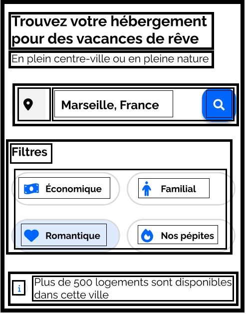
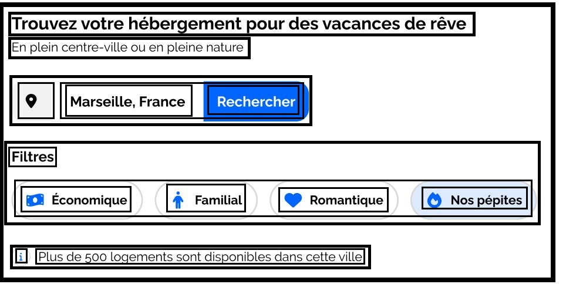
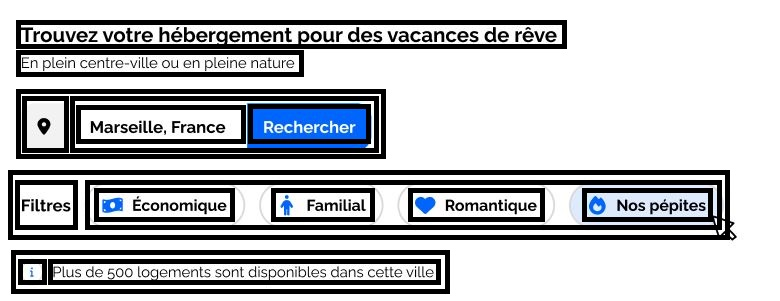

# Projet 2 – Booki

Intégration de la page d’accueil d’une agence de voyage en HTML et CSS.  
Le site vise à permettre aux usagers de trouver des hébergements et des activités dans la ville de leur choix.

## <u>**Décomposition de la maquette**</u>

La page d’accueil du site à développer comprend :

- En-tête :

  

  - Logo de Booki
  - Deux liens de navigation pour se diriger directement aux sections « Hébergements » et « Activités »

- Une 1ère partie pour la recherche:

  

  - phrase d’introduction
  - barre de recherche
  - boutons filtres
  - phrase d’information pour le nombre de résultats trouvés

- Une 2ème partie pour afficher des hébergements sous forme de cartes. Cette partie est divisée en deux sections :

  

  - Section pour afficher une liste d’hébergements et un lien « Afficher plus »
  - Section pour afficher les 3 hébergements les plus populaires

- Une 3ème partie pour afficher des activités

  

- Pied-de-page qui contient trois colonnes et des liens :

  

### <u>Breakpoints</u>

La page d’accueil étant résponsive, la maquette comporte 4 versions :

|    Device     | Largeur minimale | Largeur maximale |
| :-----------: | :--------------: | :--------------: |
|    Mobile     |      320 px      |      767 px      |
|   Tablette    |      768 px      |     1023 px      |
|    Desktop    |     1024 px      |      1439px      |
| Large Desktop |     1440 px      |                  |

> _N.B: La version 'Large Desktop' est identique à la version 'Desktop' limité à 1440px avec des marges blanches sur les côtés_

### <u>Couleurs</u>

- Primaire: #0065FC
- Sécondaire: #DEEBFF
- Background-primaire: #F2F2F2
- Background-secondaire: #D9D9D9
- Texte-noir: #020202
- Text-blanc: #fdfdfd
- Ombres: #00000038

> Pour l'implémentation des couleurs en css, des variables sont utilisées pour ces couleurs comme suit:
>
> ```css
> :root {
>   --main-color: #0065fc;
>   --secondary-color: #deebff;
>   --background-main-color: #f2f2f2;
>   --background-secondary-color: #d9d9d9;
>   --color-black: #020202;
>   --color-white: #fdfdfd;
>   --shadow-color: #00000038;
> }
> ```

### <u>Polices</u>

La police du site est [Raleway (Google Fonts)](https://fonts.google.com/specimen/Raleway) et on distingue 4 styles de texte

- 22px , Bold
- 18px , Bold
- 16px , Bold ou Normal
- 14px , Normal

> Pour faciliter l'implémentation de ces 4 styles de texte en css, il a été choisi de passer par les classes suivante:
>
> ```css
> .txt-L {
>   font-size: 1.375rem;
>   font-weight: 700;
> }
>
> .txt-M {
>   font-size: 1.125rem;
>   font-weight: 700;
> }
>
> .txt-S {
>   font-size: 1rem;
>   font-weight: 500;
> }
>
> .txt-XS {
>   font-size: 0.8rem;
>   font-weight: 500;
> }
> ```

### <u>Icônes</u>

Les icônes proviennet de [Font Awesome](https://fontawesome.com/icons)

|     Élement associé     | Nom Font Awesome |
| :---------------------: | :--------------: |
|      Bouton carte       |   location-dot   |
|    Bouton recherche     | magnifying-glass |
|   Filtre "Économique"   | money-bill-wave  |
|    Filtre "Familial"    |      person      |
|   Filtre "Romantique"   |      heart       |
|  Filtre "Nos pépites"   |       fire       |
|  Information résultats  |   circle-info    |
|    Étoile évaluation    |       star       |
| Hébergements populaires |    chart-line    |

---

## <u>**Intégration du Header**</u>

L'en-tête présente deux configuration distinctes.

Configuration pour écrans d'une largeur supérieure à 768px


Configuration pour écrans d'une largeur inférieure à 768px


### <u>Structure HTML de l'en-tête</u>

- header
  - a
    - img
  - nav
    - ul
      - li
        - a
          - Hébergements
      - li
        - a
          - Activités

<!--
> ```html
> <header class="header">
>   <a
>     href="index.html"
>     aria-label="Naviguer vers la page d'accueil">
>            class="header__logo"
>       src="images/logo/Booki.png"
>       alt="Logo de Booki" />
>   </a>
>
>   <nav
>     class="header__nav"
>     aria-label="Menu de navigation principal">
>     <ul class="nav-list">
>       <li class="nav-item">
>         <a
>           class="txt-S"
>           href="#offers-sections-container"
>           aria-label="Naviguer vers la section Hébergements"
>           >Hébergements</a
>         >
>       </li>
>       <li class="nav-item">
>         <a
>           class="txt-S"
>           href="#activities-section"
>           aria-label="Naviguer vers la section Activités"
>           >Activités</a
>         >
>       </li>
>     </ul>
>   </nav>
> </header>
> ```
-->

### <u>Mise en page de l'en-tête</u>

Le code css correspondant à la mise en page se trouve principalement dans le fichier [header.css](./css/header.css).  
De plus, deux classes se trouvant dans le fichier [style.css](./css/style.css) ont une influence sur la mise en page du header : `nav-list` et `nav-item`.

> N.B: Les classes `nav-list` et `nav-item` se trouvent dans ledit style.css car elles sont re-utilisées pour la mise en page du pied-de-page aussi.

Pour répondre aux deux mise en page différentes de l'en-tête, les propriétés `display: flex` et `flex-direction: column/row` sont appliquée à la balise `header`

> ```css
> .header {
>  padding: 0 1.5rem;
>  display: flex;
>  justify-content: space-between;
>  align-items: center;
> }
> [...]
> @media screen and (max-width: 768px) {
>  .header {
>    flex-direction: column;
>    width: 100%;
>    padding: 0;
>  }
>  [...]
> }
> ```

Pour obtenir les changements des liens de navigation quand ils sont actifs ou survolés avec la souris, ont utilise les pseudo-classes `:hover` et `:active` à travers lesquelles ont modifie certaines propriétés css

```css
[...]
.header .nav-item {
  [...]
  border-top: 0.15em solid transparent;
}

.header .nav-item:hover,
.header .nav-item:active {
  font-weight: 600;
  color: var(--main-color);
  border-top-color: var(--main-color);
}

@media screen and (max-width: 768px) {
  [...]
  .header .nav-item {
    border-top : none;
    border-bottom: 0.15em solid var(--background-main-color);
    padding: 1em 0;
  }

  .header .nav-item:hover,
  .header .nav-item:active {
    color: var(--main-color);
    border-bottom: 0.15em solid var(--main-color);
  }
}

```

---

## <u>**Intégration de la section de recherche et filtres**</u>

La section de recherche et filtres dispose de 3 configurations:

- Mobile

  

- Tablette

  

- Desktop & Large-Desktop

  

### <u>Structure HTML de la section de recherche et filtres</u>

- section
  - h2
  - p
  - div (searchbar-container)
    - button (carte)
    - form
      - input
      - button (submit)
        - span (Rechercher)
        - i (icône loupe)
  - div (filters-container)
    - h3 (Filtres)
    - ul
      - li x4
        - button x4 (Économique/Familial/Romantique/Nos pépites)
  - p - i (icône information) - texte
  <!--
  > ```html
  > <section class="search-section">
  >   <h2 class="section-title txt-L">
  >     Trouvez votre hébérgement pour des vacances de rêve
  >   </h2>
  >   <p class="section-title-info txt-S">
  >     En plein centre-ville ou en pleine nature
  >   </p>
  >   <div class="searchbar-container txt-S">
  >     <button
  >       class="searchbar-map-btn"
  >       aria-label="Acceder à la carte">
  >       <i
  >         aria-hidden="true"
  >         class="fa-solid fa-location-dot"></i>
  >     </button>
  >     <form
  >       class="searchbar-form"
  >       action=""
  >       method="post">
  >       <label
  >         for="searchbar-text-input"
  >         class="visually-hidden"
  >         >Où partir?
  >       </label>
  >       <input
  >         id="searchbar-text-input"
  >         class="searchbar-text-input"
  >         type="text"
  >         aria-label="Entrez ici votre destination de voyage"
  >         placeholder="Marseille, France" />
  >       <button
  >         class="searchbar-submit-btn-wrapper"
  >         type="submit"
  >         aria-label="Lancer la recherche">
  >         <span class="searchbar-submit-btn_text">Rechercher</span>
  >         <i
  >           aria-hidden="true"
  >           class="fa-solid fa-magnifying-glass searchbar-submit-btn_icon"></i>
  >       </button>
  >     </form>
  >   </div>
  >   <div class="filters-container">
  >     <h3 class="txt-M">Filtres</h3>
  >     <ul>
  >       <li>
  >         <button class="filter-btn txt-XS">
  >           <i
  >             aria-hidden="true"
  >             class="fa-solid fa-money-bill-wave"></i>
  >           Économique
  >         </button>
  >       </li>
  >       <li>
  >         <button class="filter-btn txt-XS">
  >           <i
  >             aria-hidden="true"
  >             class="fa-solid fa-person"></i>
  >           Familial
  >         </button>
  >       </li>
  >       <li>
  >         <button class="filter-btn txt-XS">
  >           <i
  >             aria-hidden="true"
  >             class="fa-solid fa-heart"></i>
  >           Romantique
  >         </button>
  >       </li>
  >       <li>
  >         <button class="filter-btn txt-XS">
  >           <i
  >             aria-hidden="true"
  >             class="fa-solid fa-fire"></i>
  >           Nos pépites
  >         </button>
  >       </li>
  >     </ul>
  >   </div>
  >   <p class="txt-XS">
  >     <i
  >       aria-hidden="true"
  >       class="fa-solid fa-circle-info"></i>
  >     Plus de <mark>500 logements</mark> sont disponibles dans cette ville
  >   </p>
  > </section>
  > ```
   -->

### <u>Mise en page de la section pour la recherche et les filtres</u>

Le code css correspondant à la mise en page se trouve principalement dans le fichier [search-section.css](./css/search-section.css).  
De plus, des classes communes aux autres sections de la page se trouvant dans le fichier [style.css](./css/style.css) ont une influence sur la mise en page de la section pour la recherche et les filtres :
`section`, `section-title`, `section-title-info`

Pour répondre aux différentes mises en page de cette section,

- _Barre de Recherche_: le bouton qui permet de lancer la recherche affiche soit "Rechercher" soit l'icône d'une loupe; pour ceci une media query est utilisé en combinaison avec `display: none/block`

  > ```html
  > <button
  >   class="searchbar-submit-btn-wrapper"
  >   type="submit"
  >   aria-label="Lancer la recherche">
  >   <span class="searchbar-submit-btn_text">Rechercher</span>
  >   <i
  >     aria-hidden="true"
  >     class="fa-solid fa-magnifying-glass searchbar-submit-btn_icon"></i>
  > </button>
  > ```
  >
  > ```css
  > .searchbar-submit-btn_text {
  >   font-weight: 600;
  > }
  > .searchbar-submit-btn_icon {
  >   display: none;
  > }
  > @media screen and (max-width: 768px) {
  >   .searchbar-submit-btn_text {
  >     display: none;
  >   }
  >   .searchbar-submit-btn_icon {
  >     display: block;
  >     color: var(--background-main-color);
  >   }
  > }
  > ```

- _Filtres_: deux changements s'opèrent sur les filtres; d'une part le sous-titre "Filtres" change d'emplacement par rapport aux boutons; d'autre part, la disposition des boutons eux même.

  - Sous-titre "Filtres": pour obtenir que celui-ci se place

    - soit à gauche des boutons pour les version desktop et large-desktop ,
      > à l'aide d'une media query et une div "container" en combinaison avec les propriétés `display:flex` et `flex-direction: row`
    - soit au dessus des boutons pour les versions tablette et mobile,
      > par défaut, il le positionnement normal est laissé

    > ```html
    > <div class="filters-container">
    >   <h3 class="txt-M">Filtres</h3>
    >   <ul>
    >     [...]
    >   </ul>
    > </div>
    > ```
    >
    > ```css
    > @media screen and (min-width: 1024px) {
    >   .filters-container {
    >     display: flex;
    >     align-items: center;
    >     gap: 1em;
    >   }
    > }
    > ```

  - Disposition des boutons: pour répondre aux deux configurations de la mise en page des boutons, une media query est utilisé en combinaison avec `display: flex/grid`. Pour mobile le choix d'utiliser `grid` a été fait afin de garder une disposition en deux colonnes constament.
    > ```html
    > <ul>
    >   <li>[...]</li>
    >   <li>[...]</li>
    >   <li>[...]</li>
    >   <li>[...]</li>
    > </ul>
    > ```
    >
    > ```css
    > .filters-container ul {
    >   list-style: none;
    >   margin: 0;
    >   padding: 0;
    >   display: flex;
    >   gap: 1em;
    > }
    > @media screen and (max-width: 768px) {
    >   .filters-container ul {
    >     display: grid;
    >     grid-template-columns: 1fr 1fr;
    >   }
    > }
    > ```
