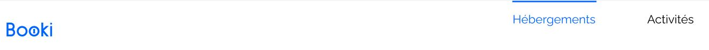
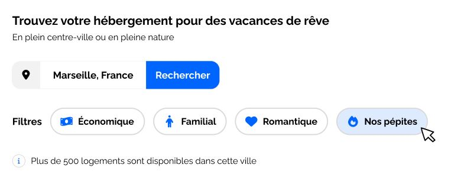
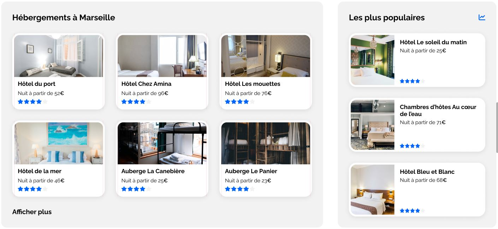
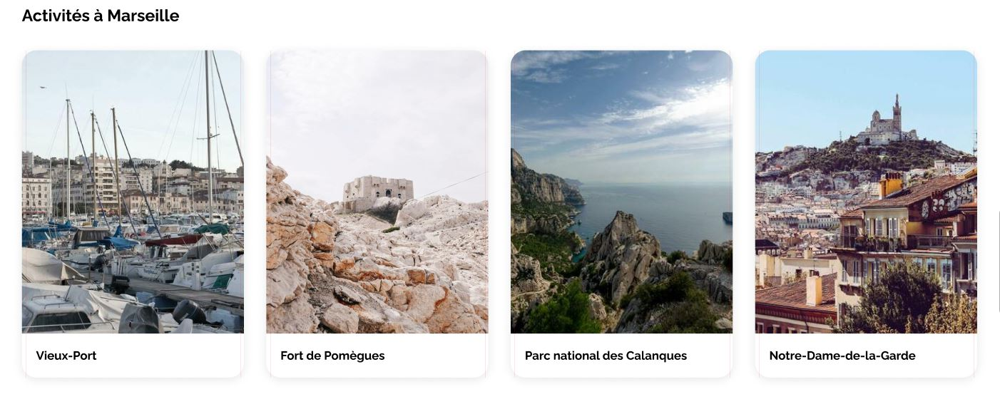
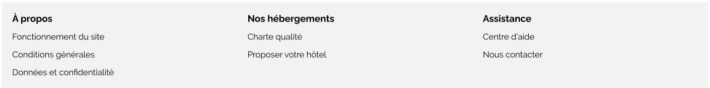
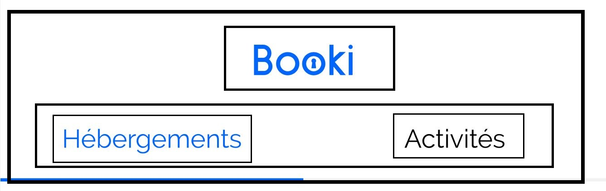

# Projet 2 – Booki

Intégration de la page d’accueil d’une agence de voyage en HTML et CSS.  
Le site vise à permettre aux usagers de trouver des hébergements et des activités dans la ville de leur choix.

## <u>**Décomposition de la maquette**</u>

La page d’accueil du site à développer comprend :

- En-tête :

  

  - Logo de Booki
  - Deux liens de navigation pour se diriger directement aux sections « Hébergements » et « Activités »

- Une 1ère partie pour la recherche:

  

  - phrase d’introduction
  - barre de recherche
  - boutons filtres
  - phrase d’information pour le nombre de résultats trouvés

- Une 2ème partie pour afficher des hébergements sous forme de cartes. Cette partie est divisée en deux sections :

  

  - Section pour afficher une liste d’hébergements et un lien « Afficher plus »
  - Section pour afficher les 3 hébergements les plus populaires

- Une 3ème partie pour afficher des activités

  

- Pied-de-page qui contient trois colonnes et des liens :

  

### <u>Breakpoints</u>

La page d’accueil étant résponsive, la maquette comporte 4 versions :

|    Device     | Largeur minimale | Largeur maximale |
| :-----------: | :--------------: | :--------------: |
|    Mobile     |      320 px      |      767 px      |
|   Tablette    |      768 px      |     1023 px      |
|    Desktop    |     1024 px      |      1439px      |
| Large Desktop |     1440 px      |                  |

> _N.B: La version 'Large Desktop' est identique à la version 'Desktop' limité à 1440px avec des marges blanches sur les côtés_

### <u>Couleurs</u>

- Primaire: #0065FC
- Sécondaire: #DEEBFF
- Background-primaire: #F2F2F2
- Background-secondaire: #D9D9D9
- Texte-noir: #020202
- Text-blanc: #fdfdfd
- Ombres: #00000038

> Pour l'implémentation des couleurs en css, des variables sont utilisées pour ces couleurs comme suit:
>
> ```css
> :root {
>   --main-color: #0065fc;
>   --secondary-color: #deebff;
>   --background-main-color: #f2f2f2;
>   --background-secondary-color: #d9d9d9;
>   --color-black: #020202;
>   --color-white: #fdfdfd;
>   --shadow-color: #00000038;
> }
> ```

### <u>Polices</u>

La police du site est [Raleway (Google Fonts)](https://fonts.google.com/specimen/Raleway) et on distingue 4 styles de texte

- 22px , Bold
- 18px , Bold
- 16px , Bold ou Normal
- 14px , Normal

> Pour faciliter l'implémentation de ces 4 styles de texte en css, il a été choisi de passer par les classes suivante:
>
> ```css
> .txt-L {
>   font-size: 1.375rem;
>   font-weight: 700;
> }
>
> .txt-M {
>   font-size: 1.125rem;
>   font-weight: 700;
> }
>
> .txt-S {
>   font-size: 1rem;
>   font-weight: 500;
> }
>
> .txt-XS {
>   font-size: 0.8rem;
>   font-weight: 500;
> }
> ```

### <u>Icônes</u>

Les icônes proviennet de [Font Awesome](https://fontawesome.com/icons)

|     Élement associé     | Nom Font Awesome |
| :---------------------: | :--------------: |
|      Bouton carte       |   location-dot   |
|    Bouton recherche     | magnifying-glass |
|   Filtre "Économique"   | money-bill-wave  |
|    Filtre "Familial"    |      person      |
|   Filtre "Romantique"   |      heart       |
|  Filtre "Nos pépites"   |       fire       |
|  Information résultats  |   circle-info    |
|    Étoile évaluation    |       star       |
| Hébergements populaires |    chart-line    |

---

## <u>**Intégration du Header**</u>

L'en-tête présente deux configuration distinctes.

Configuration pour écrans d'une largeur supérieure à 768px


Configuration pour écrans d'une largeur inférieure à 768px


### <u>Structure HTML de l'en-tête</u>

- header
  - a
    - img
  - nav
    - ul
      - li
        - a
          - Hébergements
      - li
        - a
          - Activités

> ```html
> <header class="header">
>   <a
>     href="index.html"
>     aria-label="Naviguer vers la page d'accueil">
>            class="header__logo"
>       src="images/logo/Booki.png"
>       alt="Logo de Booki" />
>   </a>
>
>   <nav
>     class="header__nav"
>     aria-label="Menu de navigation principal">
>     <ul class="nav-list">
>       <li class="nav-item">
>         <a
>           class="txt-S"
>           href="#offers-sections-container"
>           aria-label="Naviguer vers la section Hébergements"
>           >Hébergements</a
>         >
>       </li>
>       <li class="nav-item">
>         <a
>           class="txt-S"
>           href="#activities-section"
>           aria-label="Naviguer vers la section Activités"
>           >Activités</a
>         >
>       </li>
>     </ul>
>   </nav>
> </header>
> ```
