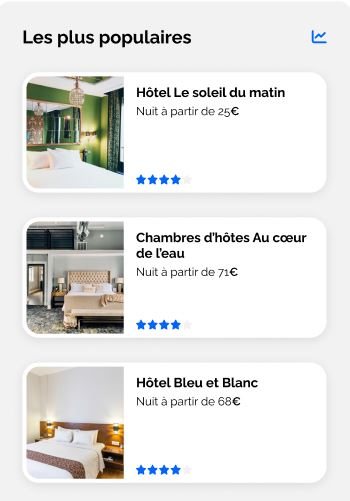

# Projet 2 – Booki

Intégration de la page d’accueil d’une agence de voyage en HTML et CSS.  
Le site vise à permettre aux usagers de trouver des hébergements et des activités dans la ville de leur choix.

## Sommaire

1. [Décomposition de la maquette](#chap-1)
   - [Breakpoints](#chap-1_breakpoints)
   - [Couleurs](#chap-1_couleurs)
   - [Polices](#chap-1_polices)
   - [Icônes](#chap-1_icones)
2. [En-tête](#chap-2)
   - [Structure HTML](#chap-2_header-html)
   - [Mise en page CSS](#chap-2_header-css)
3. [Section recherche et filtres](#chap-3)
   - [Structure HTML](#chap-3_search-section-html)
   - [Mise en page CSS](#chap-3_search-section-css)
4. [Layout sections contenant des cartes](#chap-4)
   - [Structure HTML commune aux 3 sections](#chap-4_sections-with-cards-html)
   - [Mise en page commune aux 3 sections](#chap-4_sections-with-cards-css)
   - [Conteneur de cartes: `Hébergements`](#chap-4_accommodations-cards-container-css)
   - [Conteneur de cartes: `Les plus populaires`](#chap-4_populars-cards-container-css)
   - [Conteneur de cartes: `Activités`](#chap-4_activities-cards-container-css)
5. [Cartes](#chap-5)
   - [Structure HTML commune aux 3 types de cartes](#chap-5_cards-html)
   - [Mise en page commune aux 3 types de cartes](#chap-5_cards-css)
   - [Cartes: `Hébergements`](#chap-5_accommodations-cards-css)
   - [Cartes: `Les plus populaires`](#chap-5_populars-cards-css)
   - [Cartes: `Activités`](#chap-5_activities-cards-css)
6. [Pied-de-page](#chap-6)
   - [Structure HTML](#chap-6_footer-html)
   - [Mise en page CSS](#chap-6_footer-css)

---

## <a id="chap-1"><u>**1. Décomposition de la maquette**</u></a>

La page d’accueil du site à développer comprend :

- En-tête :

  

  - Logo de Booki
  - Deux liens de navigation pour se diriger directement aux sections « Hébergements » et « Activités »

- Une 1ère partie pour la recherche:

  

  - phrase d’introduction
  - barre de recherche
  - boutons filtres
  - phrase d’information pour le nombre de résultats trouvés

- Une 2ème partie pour afficher des hébergements sous forme de cartes. Cette partie est divisée en deux sections :

  

  - Section pour afficher une liste d’hébergements et un lien « Afficher plus »
  - Section pour afficher les 3 hébergements les plus populaires

- Une 3ème partie pour afficher des activités

  

- Pied-de-page qui contient trois colonnes et des liens :

  

### <a id="chap-1_breakpoints"><u>Breakpoints</u></a>

La page d’accueil étant résponsive, la maquette comporte 4 versions :

|    Device     | Largeur minimale | Largeur maximale |
| :-----------: | :--------------: | :--------------: |
|    Mobile     |      320 px      |      767 px      |
|   Tablette    |      768 px      |     1023 px      |
|    Desktop    |     1024 px      |      1439px      |
| Large Desktop |     1440 px      |                  |

> _N.B: La version 'Large Desktop' est identique à la version 'Desktop' limité à 1440px avec des marges blanches sur les côtés_

### <a id="chap-1_couleurs"><u>Couleurs</u></a>

- Primaire: #0065FC
- Sécondaire: #DEEBFF
- Background-primaire: #F2F2F2
- Background-secondaire: #D9D9D9
- Texte-noir: #020202
- Text-blanc: #fdfdfd
- Ombres: #00000038

> Pour l'implémentation des couleurs en css, des variables sont utilisées pour ces couleurs comme suit:
>
> ```css
> :root {
>   --main-color: #0065fc;
>   --secondary-color: #deebff;
>   --background-main-color: #f2f2f2;
>   --background-secondary-color: #d9d9d9;
>   --color-black: #020202;
>   --color-white: #fdfdfd;
>   --shadow-color: #00000038;
> }
> ```

### <a id="chap-1_polices"><u>Polices</u></a>

La police du site est [Raleway (Google Fonts)](https://fonts.google.com/specimen/Raleway) et on distingue 4 styles de texte

- 22px , Bold
- 18px , Bold
- 16px , Bold ou Normal
- 14px , Normal

> Pour faciliter l'implémentation de ces 4 styles de texte en css, il a été choisi de passer par les classes suivante:
>
> ```css
> .txt-L {
>   font-size: 1.375rem;
>   font-weight: 700;
> }
>
> .txt-M {
>   font-size: 1.125rem;
>   font-weight: 700;
> }
>
> .txt-S {
>   font-size: 1rem;
>   font-weight: 500;
> }
>
> .txt-XS {
>   font-size: 0.8rem;
>   font-weight: 500;
> }
> ```

### <a id="chap-1_icones"><u>Icônes</u></a>

Les icônes proviennet de [Font Awesome](https://fontawesome.com/icons)

|     Élement associé     | Nom Font Awesome |
| :---------------------: | :--------------: |
|      Bouton carte       |   location-dot   |
|    Bouton recherche     | magnifying-glass |
|   Filtre "Économique"   | money-bill-wave  |
|    Filtre "Familial"    |      person      |
|   Filtre "Romantique"   |      heart       |
|  Filtre "Nos pépites"   |       fire       |
|  Information résultats  |   circle-info    |
|    Étoile évaluation    |       star       |
| Hébergements populaires |    chart-line    |

---

## <a id="chap-2"><u>**2. Intégration du Header**</u></a>

L'en-tête présente deux configuration distinctes.

Configuration pour écrans d'une largeur supérieure à 768px


Configuration pour écrans d'une largeur inférieure à 768px


### <a id="chap-2_header-html"><u>Structure HTML de l'en-tête</u></a>

- header
  - a
    - img
  - nav
    - ul
      - li
        - a
          - Hébergements
      - li
        - a
          - Activités

### <a id="chap-2_header-css"><u>Mise en page de l'en-tête</u></a>

Le code css correspondant à la mise en page se trouve principalement dans le fichier [header.css](./css/header.css).  
De plus, deux classes se trouvant dans le fichier [style.css](./css/style.css) ont une influence sur la mise en page du header : `nav-list` et `nav-item`.

> N.B: Les classes `nav-list` et `nav-item` se trouvent dans ledit style.css car elles sont re-utilisées pour la mise en page du pied-de-page aussi.

Pour répondre aux deux mise en page différentes de l'en-tête, les propriétés `display: flex` et `flex-direction: column/row` sont appliquée à la balise `header`

> ```css
> .header {
>  padding: 0 1.5rem;
>  display: flex;
>  justify-content: space-between;
>  align-items: center;
> }
> [...]
> @media screen and (max-width: 768px) {
>  .header {
>    flex-direction: column;
>    width: 100%;
>    padding: 0;
>  }
>  [...]
> }
> ```

Pour obtenir les changements des liens de navigation quand ils sont actifs ou survolés avec la souris, ont utilise les pseudo-classes `:hover` et `:active` à travers lesquelles ont modifie certaines propriétés css

```css
[...]
.header .nav-item {
  [...]
  border-top: 0.15em solid transparent;
}

.header .nav-item:hover,
.header .nav-item:active {
  font-weight: 600;
  color: var(--main-color);
  border-top-color: var(--main-color);
}

@media screen and (max-width: 768px) {
  [...]
  .header .nav-item {
    border-top : none;
    border-bottom: 0.15em solid var(--background-main-color);
    padding: 1em 0;
  }

  .header .nav-item:hover,
  .header .nav-item:active {
    color: var(--main-color);
    border-bottom: 0.15em solid var(--main-color);
  }
}

```

---

## <a id="chap-3"><u>**3. Intégration de la section de recherche et filtres**</u></a>

La section de recherche et filtres dispose de 3 configurations:

- Mobile

  

- Tablette

  

- Desktop & Large-Desktop

  

### <a id="chap-3_search-section-html"><u>Structure HTML de la section de recherche et filtres</u></a>

- section
  - h2
  - p
  - div (searchbar-container)
    - button (carte)
    - form
      - input
      - button (submit)
        - span (Rechercher)
        - i (icône loupe)
  - div (filters-container)
    - h3 (Filtres)
    - ul
      - li x4
        - button x4 (Économique/Familial/Romantique/Nos pépites)
  - p - i (icône information) - texte

### <a id="chap-3_search-section-css"><u>Mise en page de la section pour la recherche et les filtres</u></a>

Le code css correspondant à la mise en page se trouve principalement dans le fichier [search-section.css](./css/search-section.css).  
De plus, des classes communes aux autres sections de la page se trouvant dans le fichier [style.css](./css/style.css) ont une influence sur la mise en page de la section pour la recherche et les filtres :
`section`, `section-title`, `section-title-info`

Pour répondre aux différentes mises en page de cette section,

- _Barre de Recherche_: le bouton qui permet de lancer la recherche affiche soit "Rechercher" soit l'icône d'une loupe; pour ceci une media query est utilisé en combinaison avec `display: none/block`

  > ```html
  > <button
  >   class="searchbar-submit-btn-wrapper"
  >   type="submit"
  >   aria-label="Lancer la recherche">
  >   <span class="searchbar-submit-btn_text">Rechercher</span>
  >   <i
  >     aria-hidden="true"
  >     class="fa-solid fa-magnifying-glass searchbar-submit-btn_icon"></i>
  > </button>
  > ```
  >
  > ```css
  > .searchbar-submit-btn_text {
  >   font-weight: 600;
  > }
  > .searchbar-submit-btn_icon {
  >   display: none;
  > }
  > @media screen and (max-width: 768px) {
  >   .searchbar-submit-btn_text {
  >     display: none;
  >   }
  >   .searchbar-submit-btn_icon {
  >     display: block;
  >     color: var(--background-main-color);
  >   }
  > }
  > ```

- _Filtres_: deux changements s'opèrent sur les filtres; d'une part le sous-titre "Filtres" change d'emplacement par rapport aux boutons; d'autre part, la disposition des boutons eux même.

  - Sous-titre "Filtres": pour obtenir que celui-ci se place

    - soit à gauche des boutons pour les version desktop et large-desktop ,
      > à l'aide d'une media query et une div "container" en combinaison avec les propriétés `display:flex` et `flex-direction: row`
    - soit au dessus des boutons pour les versions tablette et mobile,
      > par défaut, il le positionnement normal est laissé

    > ```html
    > <div class="filters-container">
    >   <h3 class="txt-M">Filtres</h3>
    >   <ul>
    >     [...]
    >   </ul>
    > </div>
    > ```
    >
    > ```css
    > @media screen and (min-width: 1024px) {
    >   .filters-container {
    >     display: flex;
    >     align-items: center;
    >     gap: 1em;
    >   }
    > }
    > ```

  - Disposition des boutons: pour répondre aux deux configurations de la mise en page des boutons, une media query est utilisé en combinaison avec `display: flex/grid`. Pour mobile le choix d'utiliser `grid` a été fait afin de garder une disposition en deux colonnes constament.
    > ```html
    > <ul>
    >   <li>[...]</li>
    >   <li>[...]</li>
    >   <li>[...]</li>
    >   <li>[...]</li>
    > </ul>
    > ```
    >
    > ```css
    > .filters-container ul {
    >   list-style: none;
    >   margin: 0;
    >   padding: 0;
    >   display: flex;
    >   gap: 1em;
    > }
    > @media screen and (max-width: 768px) {
    >   .filters-container ul {
    >     display: grid;
    >     grid-template-columns: 1fr 1fr;
    >   }
    > }
    > ```

---

## <a id="chap-4"><u>**4. Intégration sections contenant des cartes: points communs**</u></a>

Les trois sections qui contiennet des cartes sont:

- **Hébergements**

  

- **Les plus populaires**

  

- **Activités**

  

### <a id="chap-4_sections-with-cards-html"><u>Structure HTML commune aux trois sections </u></a>

Les sections `Hébergements`, `Les plus populaires` et `Activités` sont toutes structurées de façon similaire:

- un titre
- conteneur des cartes
  - cartes

> On remarque tout de même:
>
> - `Hébergements`: contient un lien en dessous du conteneur de cartes
> - `Les plus populaires`: le titre est accompagé d'une icône à gauche

Pour répondre à cette structure, tout en tenant compte du lien de la section `Hébergements` et de l'icône de la section `Les plus populaires`, pour chacune de ces sections il a été choisi d'adopter la strucutre HTML suivante:

- section
  - élément titre (h2 ou bien div > h2 + i)
  - div (cards-container)
    - cartes (voir chapitres sur les cartes)
  - a (seulement section `Hébergement`)

Cette strucure html permettra de dégager certaines propriétés CSS communes aux 3 sections, notamment en rapport avec la disposition des titres et des conteneurs dans la sections ou encore l'espacement entre eux.

### <a id="chap-4_sections-with-cards-css"><u>Mise en page commune aux trois sections</u></a>

Le code css correspondant à la mise en page se trouve principalement dans le fichier [layout-sections-with-cards.css](./css/layout-sections-with-cards.css).

De plus, des classes se trouvant dans le fichier [style.css](./css/style.css) ont une influence sur la mise en page des sections : `section`, `section-title` et `section-title-info`.

On remarque que le titre et accesoirement le lien, prennent l'espace qu'ils ont besoin, et les conteneurs de cartes prennent toute la place restante disponible dans la section.

> Pour obtenir ce résultat:
>
> ```css
> section {
>   [...]
>   display: flex;
>   flex-direction: column;
> }
> .cards-container {
>     [...]
>     flex: 1 1 100%
>  }
> ```

### <a id="chap-4_offers-sections-container-css"><u>Placement des sections `Hébergements` et `Les plus populaires`: varie en fonction de l'écran</u></a>

On observe que l'emplacement dans la page des sections `Hébergements` et `Les plus populaires` varie en fonction de la largeur de l'écran. Pour cette raison ces deux sections se trouvent dans un `div class="offers-sections-container"`

- Mobile :
  - `Les plus populaires` (dessus)
  - `Hébergements` (dessous)
    > `flex-direction: column-reverse`
- Tablette:
  - `Hébergements` (dessus)
  - `Les plus populaires` (dessous)
    > `flex-direction: column`
- Desktop & Large-Desktop:
  - || `Hébergements` (gauche) || `Les plus populaires` (droite) ||
    > `flex-direction: row`

> ```css
> .offers-sections-container {
>   display: flex;
>   gap: 1.375rem;
>   justify-content: space-between;
> }
>
> @media screen and (max-width: 768px) {
>   .offers-sections-container {
>     flex-direction: column-reverse;
>   }
> }
>
> @media screen and (min-width: 768px) and (max-width: 1024px) {
>   .offers-sections-container {
>     flex-direction: column;
>   }
> }
> ```

### <a id="chap-4_accommodations-cards-container-css"><u> Conteneur des cartes : `Hébergements`</u></a>

On distingue deux configuration différentes :

- Mobile: les cartes sont disposées en colonne

  

  > ```css
  > @media screen and (max-width: 768px) {
  >   .accommodations-section .cards-container {
  >     flex-direction: column;
  >   }
  > }
  > ```

- Tablette, Desktop et Large-Destop: les cartes sont rangées en lignes.

  > On intérprete le rangement des cartes dans la maquette en lignes car dans les recommendations il est suggéré d'utiliser Flexbox.

  

  > ```css
  >  .cards-container {
  >    [...]
  >    display: flex;
  >  }
  >  .accommodations-section .cards-container {
  >    flex-wrap: wrap;
  >  }
  > ```

### <a id="chap-4_populars-cards-container-css"><u> Conteneur des cartes : `Les plus populaires`</u></a>

On distingue deux configuration différentes :

- Mobile, Desktop & Large-Desktop: les cartes sont disposées en colonne

  

  > ```css
  >  .cards-container {
  >    [...]
  >    display: flex;
  >  }
  >  .populars-section .cards-container {
  >    flex-direction: column;
  >  }
  > ```

- Tablette: les cartes sont rangées en une ligne.

  

  > ```css
  > @media screen and (min-width: 768px) and (max-width: 1024px) {
  >   .populars-section .cards-container {
  >     flex-direction: row;
  >   }
  > }
  > ```

### <a id="chap-4_activities-cards-container-css"><u> Conteneur des cartes : `Activités`</u></a>

On distingue deux configuration différentes :

- Mobile: les cartes sont disposées en colonne

  

  > ```css
  > @media screen and (max-width: 768px) {
  >   .activities-section .cards-container {
  >     flex-direction: column;
  >   }
  > }
  > ```

- Tablette, Desktop et Large-Destop: les cartes sont rangées en lignes.

  

  > ```css
  >  .cards-container {
  >    [...]
  >    display: flex;
  >  }
  > ```

---

## <a id="chap-5"><u>**5. Intégration des cartes: points communs**</u></a>

On distingue trois types de cartes:

- **Hébergements**

  

- **Les plus populaires**

  

- **Activités**

  

### <a id="chap-5_cards-html"><u>Structure HTML commune aux trois sections </u></a>

Les cartes des sections `Hébergements`, `Les plus populaires` et `Activités` sont toutes structurées de façon similaire:

- une image
- un conteneur pour le contenu informatif

> On remarque aussi deux points:
>
> 1.  Les cartes sont clickable dans leur intégralité
>
> 2.  Le contenu informatif varie en fonction des cartes:
>
>     - `Hébergements` et `Les plus populaires`, le contenu informatif est:
>       - titre
>       - prix par nuit
>       - note
>     - `Activités`, le contenu informatif est seulement le titre de l'activité

Pour répondre à cette structure, tout en tenant compte des différences entre les contenus informatifs, les cartes suivent la strucutre HTML suivante:

- a = card-link-wrapper
  - article = card
    - div = card-image-wrapper
      - img
    - div = card-content
      - h3 = card-title
      - p = card-title-info _(seulement pour `Hébergements` et `Les plus populaires`)_
      - div = card-rating _(seulement pour `Hébergements` et `Les plus populaires`)_
        - i x5 _(seulement pour `Hébergements` et `Les plus populaires`)_

Cette strucure html permettra de dégager certaines propriétés CSS communes aux 3 types de cartes, notamment en rapport avec la disposition des image et du contenu dans la carte ou encore l'espacement entre eux.

### <a id="chap-5_cards-css"><u>Mise en page commune aux 3 types de carte </u></a>

Le code css correspondant à la mise en page se trouve principalement dans le fichier [cards.css](./css/cards.css).

L'agencement de l'image et du contenu des trois types de cartes est géré via les propriété `display:flex` et `flex-direction: column/row`

De plus des valeurs en pourcentage sont utilisé pour délimiter l'espace occupé par l'image et par le contenu dans chaque type de carte.

### <a id="chap-5_accommodations-cards-css"><u> Mise en page des cartes `Hébergements` </u></a>

La carte `Hébergements` est disposé verticalement, avec l'image qui occupe 60% de la hauteur et le contenu 40%.  
De plus, on remarque dans la maquette que celle-ci est de taille fixe, sauf pour la version mobile qu'elle occupe toute la largeur disponible.

> ```css
> [...]
> .accommodations-section .card-link-wrapper {
>   width: 15.19rem;
>   height: 12.95rem;
> }
> .accommodations-section .card-image-wrapper {
>   height: 60%;
>   [...]
> }
> .accommodations-section .card-content {
>   height: 40%;
> }
> @media screen and (max-width: 768px) {
>   .accommodations-section .card-link-wrapper {
>     width: 100%;
>   }
> }
> ```

### <a id="chap-5_populars-cards-css"><u> Mise en page de la carte `Les plus populaires`</u></a>

La carte `Les plus populaire` est disposé horizontalement, avec l'image qui occupe 32% de la largeur et le contenu 65%.  
De plus, on remarque dans la maquette que sa hauteur est fixe et que sa largeur est toujours 100% de l'espace qui lui est alloué (en disposition horizontal 1/3 de la largeur du conteneur; en disposition vertical 100% de la largeur du conteneur).

> ```css
> [...]
> .populars-section .card-link-wrapper {
>   height: 9.125rem;
> }
>
> .populars-section .card-image-wrapper {
>   width: 32%;
>   [...]
> }
>
> .populars-section .card-content {
>   width: 65%;
> }
> ```

### <a id="chap-5_activities-cards-css"><u> Mise en page de la carte `Activités`</u></a>

La carte `Activités` est disposé verticalement, avec l'image qui occupe 80% de la hauteur et le contenu 20% (seulement le titre de l'activité).  
De plus, on remarque dans la maquette que sa hauteur est variable en fonction de l'écran, et que sa largeur est toujours 100% de l'espace qui lui est alloué (en disposition horizontal 1/4 de la largeur du conteneur; en disposition vertical 100% de la largeur du conteneur)

> ```css
> [...]
> .activities-section .card-image-wrapper {
>   height: 80%;
>   [...]
> }
>
> .activities-section .card-content {
>   height: 20%;
>   [...]
> }
>
> @media screen and (max-width: 768px) {
>   .activities-section .card-link-wrapper {
>     height: 12.5rem;
>   }
> }
>
> @media screen and (min-width: 768px) and (max-width: 1024px) {
>   .activities-section .card-link-wrapper {
>     height: 16.87rem;
>   }
> }
>
> @media screen and (min-width: 1024px) {
>   .activities-section .card-link-wrapper {
>     height: 27.43rem;
>   }
> }
> ```

---

## <a id="chap-6"><u>**6. Intégration du Footer**</u></a>

L'pied-de-page présente deux configuration distinctes.

- _Desktop et Tablette_:

  

- _Mobile_:

  

### <a id="chap-6_footer-html"><u>Structure HTML du pied-de-page</u></a>

On remarque que le pied-de-page est composé de trois parties disctinctes, chacune agencée en une colonne et chacune contenant des liens pour naviguer vers d'autres page du site web.

Pour répondre à ceci, la structure HTML suivante à été choisie:

- footer
  - div x3
    - h2
    - nav
      - ul
        - li x3
          - a x3

### <a id="chap-6_footer-css"><u>Mise en page du pied-de-page</u></a>

Pour répondre aux deux configurations du pied-de-page (agencement vertical ou horizontal), les propriétés `display:flex` et `flex-direction: row/column` sont appliquées à la balise footer

> ```css
> .footer {
>   [...]
>   display: flex;
>   justify-content: space-around;
> }
> @media screen and (max-width: 768px) {
>   .footer {
>     flex-direction: column;
>     justify-content: space-between;
>   }
> }
> ```

Pour répondre à l'agencement vertical de chacune des parties du footer, les propriétés `display:flex` et `flex-direction: column` sont utilisées dans chacune desdites parties.

> ```css
> .footer-section {
>   [...]
>   display: flex;
>   flex-direction: column;
> }
>
> .footer-section .nav-list {
>   flex-direction: column;
>   justify-content: space-around;
> }
> ```
